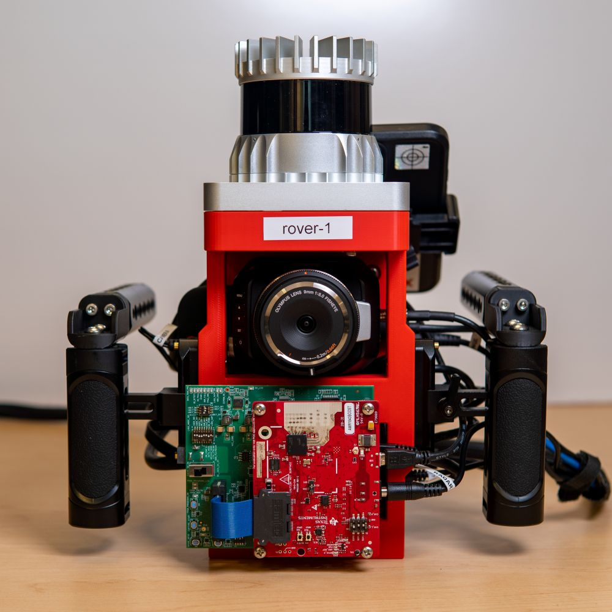

# **Red Rover**: A Multimodal mmWave Radar Spectrum Ecosystem

    
    

The **red rover**[^1] project is an end-to-end system for collecting, loading, and processing mmWave radar time signal data along with lidar and camera data designed for both [DART](https://wiselabcmu.github.io/dart/)-style reconstruction and [GRT](https://wiselabcmu.github.io/grt/)-style deep learning.

!!! info

    While packaged together as a mono-repo, each module is designed to be able to be installed and used separately. See each module's documentation for requirements and setup instructions.

[^1]: Red Rover is an [evolved](https://en.wikipedia.org/wiki/Pok%C3%A9mon_Red,_Blue,_and_Yellow) version of our previous data collection system, [rover](https://github.com/wiseLabCMU/rover), which happens to be red.

## Red Rover

- :material-golf-cart: [`roverc`](./roverc/index.md)

    ---

    radar + lidar + camera + imu data collection system

- :material-database-cog: [`roverd`](./roverd/index.md)

    ---

    efficient recording and storage format with an adl-compliant dataloader

- :material-factory: [`roverp`](./roverp/index.md)

    ---

    data processing and visualization tooling for red rover

- :material-database: [`i/q-1m`](./iq1m/index.md)

    ---

    one million i/q frames across indoor, outdoor, and bike-mounted settings

## See Also

- :material-cube-outline: [`abstract_dataloader`](https://radarml.github.io/abstract-dataloader/)

    ---

    abstract interface for composable dataloaders and preprocessing pipelines

- :material-antenna: [`xwr`](https://radarml.github.io/xwr/)

    ---

    python interface for collecting raw time signal data from TI mmWave radars

- :octicons-ai-model-16: [`nrdk`](https://radarml.github.io/nrdk/)

    ---

    neural radar development kit for deep learning on multimodal radar data

- :fontawesome-solid-hexagon-nodes: [`grt`](https://wiselabcmu.github.io/grt/)

    --- 

    *our latest work, GRT: Towards Foundational Models for Single-Chip Radar*

- :dart: [`dart`](https://wiselabcmu.github.io/dart/)

    ---

    *our prior work, DART: Implicit Doppler Tomography for Radar Novel View Synthesis*

- :material-video-wireless-outline: [`rover`](https://github.com/wiseLabCMU/rover)

    ---

    *our previous data collection platform for radar time signal*

