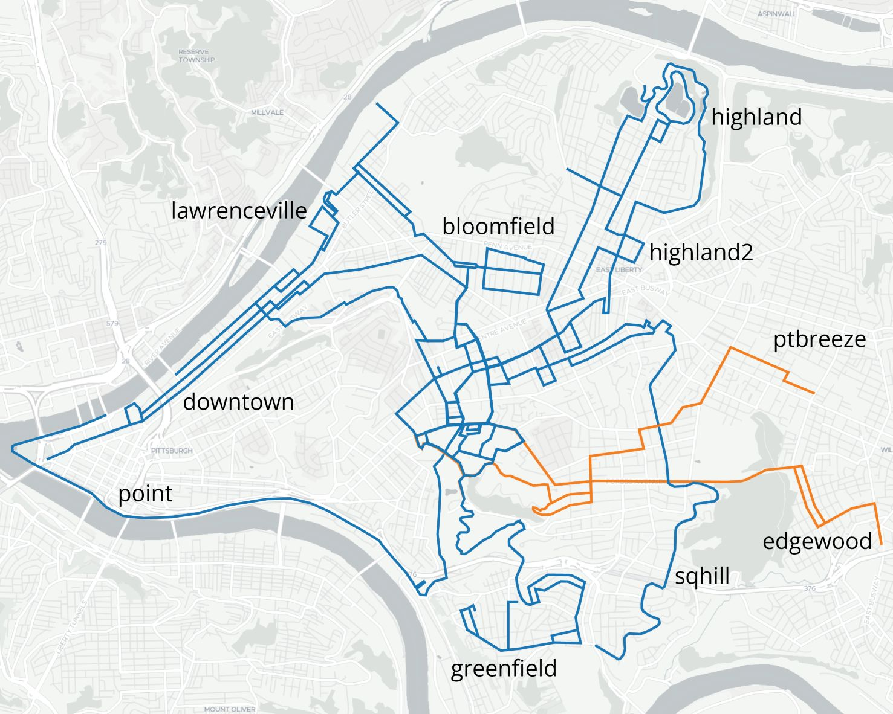
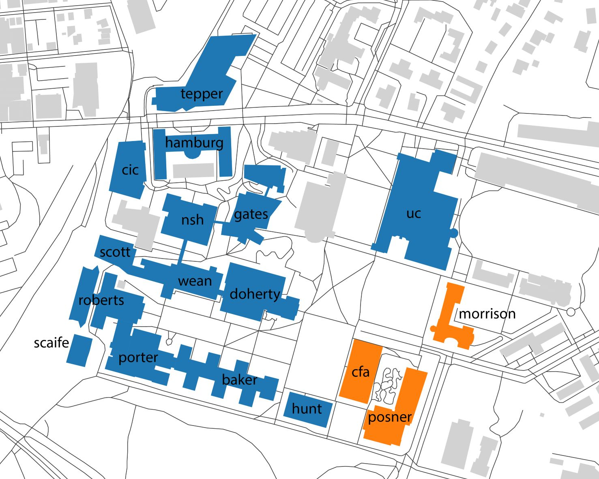
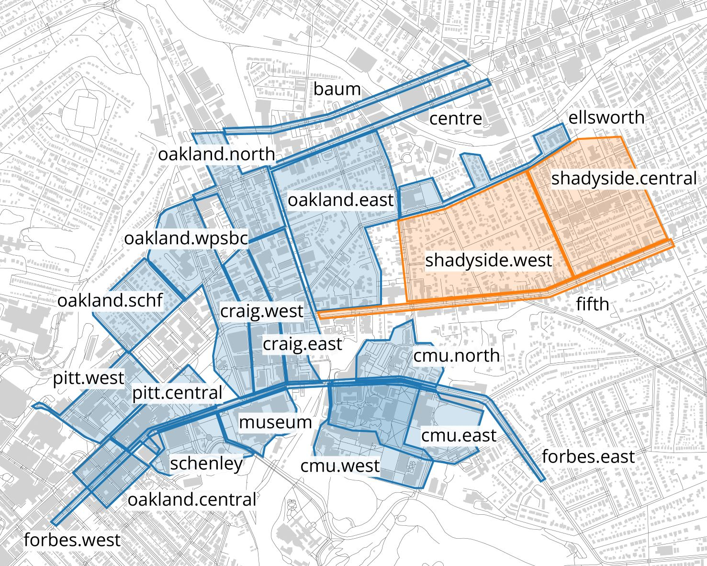

# I/Q-1M: one million i/q frames


<div style="display: grid; grid-template-columns: repeat(auto-fit, minmax(200px, 1fr)); gap: 5px;">
    
    
    
</div>

!!! info

    We are currently working to prepare the dataset for public release and distribution. For the time being, please contact Tianshu Huang (<tianshu2@andrew.cmu.edu>) for access.

## Overview

The I/Q-1M dataset consists of 1M radar-lidar-camera samples[^1] over 29 hours across indoor, outdoor, and bike-mounted settings, each with a mobile observer:

- `indoor`: inside buildings at a slow to moderate walking pace, visiting multiple floors and areas within each.
- `outdoor`: neighborhoods ranging from single family detached to high density commercial zoning at a moderate to fast walking pace.
- `bike`: bike rides in different directions from a set starting point with a moderate biking pace.

!!! tip

    See our paper for more details about the dataset. Make sure to download the arxiv version to see the attached (and linked) appendix!

[^1]: The radar was collected at 20Hz, the Lidar at 10Hz, and the camera at 30Hz; as such, Lidar is limiting sensor to arrive at our 1M sample count.

| Setting | Size | Length | Average Speed | Max Doppler | Max Range |
|---------|------|--------|---------------|-------------|-----------|
| `indoor` | 310k | 8.9h | 1.0m/s | 1.2m/s | 11.2m |
| `outdoor` | 372k | 10.7h | 1.4m/s | 1.8m/s | 22.4m |
| `bike` | 333k | 9.3h | 5.4m/s | 8.0m/s | 22.4m |

## Index of Files

!!! tip

    See the [roverd](../roverd/index.md) documentation for details about the data format.

```
{sequence}
 ┣ 📂_camera
 ┃ ┣ 📜meta.json
 ┃ ┣ 📜pose.npz             # interpolated cartographer poses with camera timestamps
 ┃ ┣ 📜segment              # lzma-compressed semantic segmentation class maps
 ┃ ┣ 📜segment_i            # byte offsets
 ┃ ┗ 📜ts                   # camera timestamps (same as camera/ts)
 ┣ 📂_lidar
 ┃ ┗ 📜pose.npz             # cartographer poses with lidar timestamps
 ┣ 📂_radar
 ┃ ┗ 📜pose.npz             # cartographer poses with radar timestamps
 ┣ 📂_slam
 ┃ ┗ 📜trajectory.csv       # raw cartographer output
 ┣ 📂camera
 ┃ ┣ 📜meta.json
 ┃ ┗ 📜ts                   # camera timestamps (30Hz)
 ┣ 📂imu
 ┃ ┣ 📜acc                  # linear acceleration
 ┃ ┣ 📜avel                 # angular velocity
 ┃ ┣ 📜meta.json
 ┃ ┣ 📜rot                  # rotation
 ┃ ┗ 📜ts                   # IMU timestamps (100Hz)
 ┣ 📂lidar
 ┃ ┣ 📜lidar.json
 ┃ ┣ 📜meta.json
 ┃ ┣ 📜nir                  # lzma-compressed near-infrared image
 ┃ ┣ 📜nir_i                # byte offsets
 ┃ ┣ 📜rfl                  # lzma-compressed IR reflectance
 ┃ ┣ 📜rfl_i                # byte offsets
 ┃ ┣ 📜rng                  # lzma-compressed beam-time depth map
 ┃ ┣ 📜rng_i                # byte offsets
 ┃ ┗ 📜ts                   # lidar timestamps (10Hz)
 ┣ 📂radar
 ┃ ┣ 📜iq                   # raw complex time signal
 ┃ ┣ 📜meta.json
 ┃ ┣ 📜radar.json           # radar intrinsics
 ┃ ┣ 📜ts                   # radar timestamps (20Hz)
 ┃ ┗ 📜valid                # whether frames contain zero-filled dropped packets
 ┗ 📜config.yaml            # original data collection configuration
```

??? info "Semantic Segmentation Classes"

    | 0 | 1 | 2 | 3 |
    |---|---|---|---|
    | flat | nature | sky | structure |

    | 4 | 5 | 6 | 7 |
    |---|---|---|---|
    | ceiling | object | person | vehicle |

    For full details about the class definitions, see the [class mapping](https://github.com/RadarML/red-rover/blob/main/processing/models/segformer-b5-finetuned-ade-640-640/classes.yaml) and [original ADE20k dataset](https://groups.csail.mit.edu/vision/datasets/ADE20K/).
