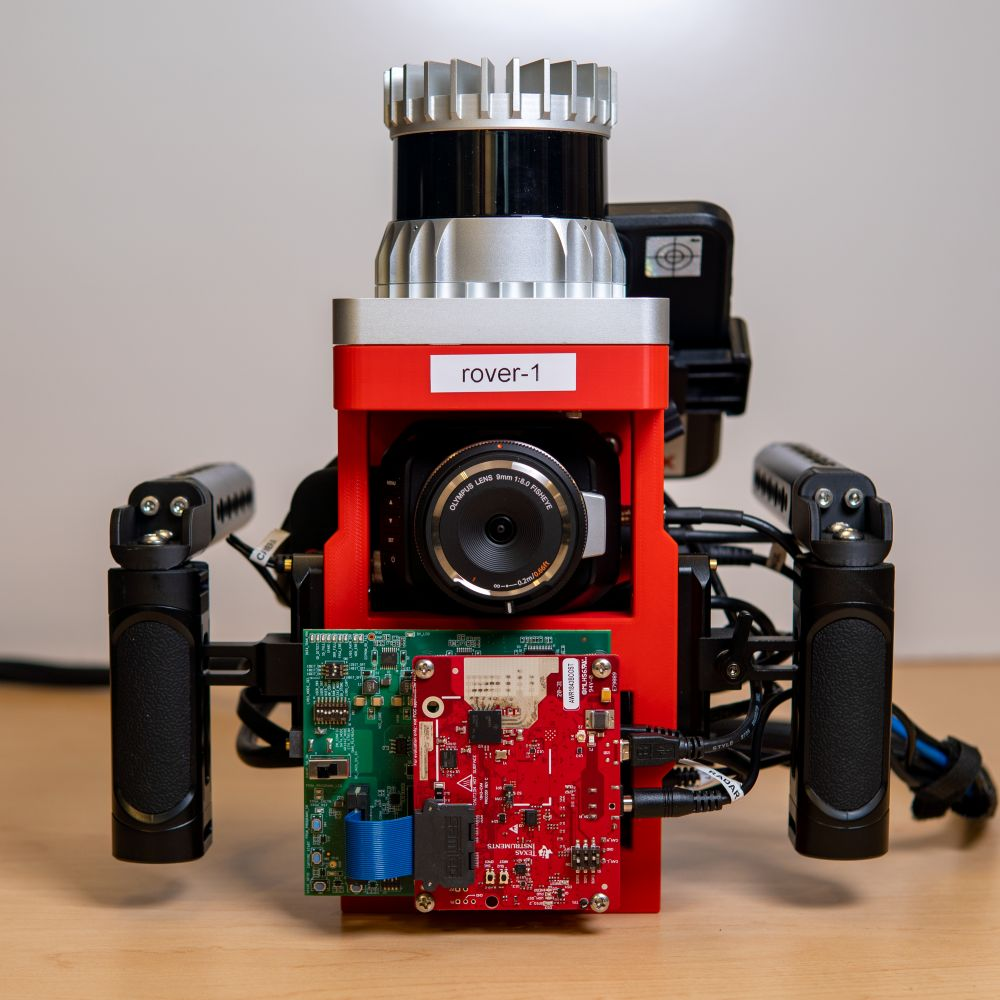

# Hardware Assembly

## Bill of Materials

!!! warning

    Listed prices are as of August 2024, and may be out of date.

    Prices for minor items (fasteners, connectors, cables, etc) are also omitted.

!!! info

    Building `red-rover` requires a 3D printer with a print bed size of at least 200x120x50mm (LxWxH); we used a Bambu Lab X1C with Bambu Red PLA Basic filament.

??? quote "Electrical"

    **Core Components**

    | Cost | Qty | Description |
    | ---- | --- | ----------- |
    | $299.00 | 1 | [TI AWR1843Boost](https://www.ti.com/tool/AWR1843BOOST) Radar + 5V3A barrel jack power supply if not included |
    | $599.00 | 1 | [TI DCA1000EVM](https://www.ti.com/tool/DCA1000EVM) Capture Card |
    | ~$1,000 | 1 | NUC, with included VESA mounting plate |
    | ~$8,000-$12,000 | 1 | [Ouster OS0-64 or OS0-128](https://ouster.com/products/hardware/os0-lidar-sensor) |
    | $449.00 | 1 | [Xsens MTi-3](https://shop.movella.com/us/product-lines/sensor-modules/products/mti-3-ahrs-development-kit) |
    | $995.00 | 1 | [Black Magic Micro Studio Camera (BMMSC)](https://www.bhphotovideo.com/c/product/1787638-REG/blackmagic_design_micro_studio_camera_4k.html) |
    | $299.00 | 1 | [Magewell 1080p60 USB-SDI capture card](https://www.bhphotovideo.com/c/product/1350328-REG/magewell_32070_usb_3_0_sdi_capture.html) |
    | $99.0 | 1 | [Olympus Fisheye Body Cap Lens](https://www.bhphotovideo.com/c/product/1026132-REG/olympus_v325040bw000_bcl_0980_fisheye_body_cap.html)
    | $28.00 | 1 | [Micro BNC to BNC cable](https://www.amazon.com/HangTon-Female-Adapter-Blackmagic-Monitor/dp/B09BJQNDNP) |
    | $6.29 | 1 | [BNC Coupler](https://www.amazon.com/TLS-eagle-Coaxial-Coupler-Straight-Connector/dp/B083LZ39HM/) |
    | $31.90 | 1 | [Router](https://www.amazon.com/GL-iNet-GL-AR300M16-Ext-Pre-Installed-Performance-Programmable/dp/B07794JRC5) + power supply, power cable if not included |
    | $9.99 | 1 | [USB A Hub](https://www.bhphotovideo.com/c/product/1496562-REG/xcellon_usb_4311_2_slim_4_port_usb_3_1.html) |
    | - | 1 | AC battery bank; should be able to supply >200W. |
    | - | 2 | 6" Cat 5/6 Ethernet cable |
    | - | 2 | 6" micro USB to USB A type 2.0 cable
    | - | 1 | Power strip |

    **Optional Accessories**

    | Cost | Qty | Description |
    | ---- | --- | ----------- |
    | $329.99 | 2 | [External SSD](https://www.bhphotovideo.com/c/product/1595436-REG/sandisk_sdssde81_4t00_g25_4tb_extremepro_portable_ssd.html) |
    | $349 | 1 | ["Lapdock" (screen + keyboard + trackpad)](https://www.amazon.com/NexDock-Touchscreen-Wireless-Portable-Compatible/dp/B0CSK2T47Q/) |

??? quote "Mechanical"

    **3D Printed Parts**

    | Item | Qty | Description | 
    | ---- | --- | ----------- |
    | `top-plate.stl` | 1 | Mount for Lidar, IMU |
    | `front-plate.stl` | 1 | Primary vertical structure |
    | `mid-plate.stl` | 1 | Connects top plate to the NUC VESA mounting plate |
    | `bottom-plate.stl` | 1 | Provides structural support, and a tray to put cables in |
    | `handle-bracket.stl` | 2 | Joins vertical and horizontal handles |
    | `radar-cover.stl` | 1 | Protective cover for the radar; should be covered in ESD tape / other material |

    **COTS Parts**

    | Cost   | Qty | Description |
    | ------ | --- | ----------- |
    | $19.90 | 2   | [Top handles](https://www.bhphotovideo.com/c/product/1736879-REG/smallrig_1638c_top_handle_1_4_20_screws.html) |
    | $29.90 | 2   | [Side handles](https://www.bhphotovideo.com/c/product/1689008-REG/smallrig_3813_mini_nato_side_handle.html) |
    | $9.90  | 2   | [Mounting Rail](https://www.bhphotovideo.com/c/product/1502679-REG/smallrig_1195b_quick_release_safety_rail.html) |
    | -      | 1   | 1/4-20 Ball Head |
    | -      | 1   | Phone Tripod Mount |

??? quote "Fasteners"

    | Qty | Description |
    | --- | ----------- |
    | 9   | 1/4-20 Nut |
    | 8   | 1/4-20 x 15mm socket cap |
    | 3   | 1/4-20 x 15mm round head |
    | 4   | 1/4-20 x 25mm round head |
    | 20  | M4 nut |
    | 18  | M4 lock washer |
    | 8   | M4 x 10mm socket cap |
    | 4   | M4 x 12mm socket cap |
    | 12  | M4 x 16mm socket cap |
    | 2   | M3 x 6mm female-female standoff |
    | 2   | M3 x 6mm male-female standoff |
    | 4   | M3 x 15mm female-female standoff (included with AWR1843Boost) |
    | 4   | M3 x 15mm male-female standoff |
    | 4   | M3 x 5mm round head (included with AWR1843Boost) |
    | 6   | M3 x 8mm socket cap |

## Sub-assemblies

### Handles (2x)

{: style="width: 20%"}
{: style="width: 20%"}
{: style="width: 45%"}

1. Assemble the side handles according to the manufacturer's instructions by attaching the NATO rail mount.

2. Attach a `handle-bracket.stl` to the top of each side handle using `2x 1/4-20x15mm round head screws` each.

3. Attach the top handles to the handle bracket using `2x M4x12mm screws` each.

!!! info

    Viewed relative to the top handle facing towards you, one handle (for the left side side) should have the adjustment knob facing forward and the mounting rail facing right, while the other (for the right side) should have the adjustment knob facing forward and the mounting rail facing left.

    

    

    

    

### Top Subassembly

{: style="width: 35%"}
{: style="width: 35%"}

1. Attach `2x M3x6mm F/M` standoffs to the small holes in the `top-plate.stl` using `2x M3x8mm screws`.

2. Press-fit `4x 1/4-20 nuts` and `6x M4 nuts` to the matching holes.

    !!! info

        If the M4 nuts will not stay in, don't attach the IMU or fit the nuts until final assembly.

3. Plug in a Micro USB cable, and attach the `Xsens MTi-3 IMU` using `2x M3x6mm F/F` standoffs. Hot-glue the USB connector to the top plate

    !!! info

        You can use `M3 nuts` instead, but small standoffs are usually easier to work with and either tighten by hand, or using a small socket driver.

### Rear Subassembly

1. Attach the `bottom-plate.stl` to the mounting plate included with the NUC using `4x M4 nuts`, `4x M4x10mm screws`, and `4x M4 lock washers`.

2. Attach the `top-plate.stl` to the mounting plate included with the NUC using `4x M4 nuts`, `4x M4x10mm screws`, and `4x M4 lock washers`.

    !!! warning

        Make sure the orientation of the mounting plate is correct! The "This way up" arrow should point towards the `top-plate.stl`, and the screw heads should be inset into the mounting hole divots.

3. Press-fit `2x M4 nuts` into the matching holes on the `top-plate.stl`.

4. Insert a `1/4-20 nut` into the matching hole on the `top-plate.stl`, and screw a `1/4-20x15mm round head screw` into the nut from the other side. The screw head should be fully flush in the recess.

### Front Subassembly

1. Attach the two NATO rails to each side of the `front-plate.stl` using `4x 1/4-20 nuts` and `4x 1/4-20x18mm socket cap screws`.

2. Attach `4x M3x15mm M/F` standoffs to the slotted holes using `4x M3x8mm screws`.

3. Fit the `DCA1000EVM` capture card to the standoffs.

4. Screw `4x M3x15mm F/F` standoffs (included with the AWR1843Boost) on the exposed standoffs, mounting the capture card in place.

5. Fit the `AWR1843Boost` radar to the standoffs from the previous step, securing it in place with `4x M3x5mm screws` (included with the AWR1843Boost).

6. Attach the `Black Magic Micro Studio Camera` to the `front-plate.stl` using `2x 1/4-20x15mm round head screws`.

    {: style="width: 50%"}

## Final assembly

### Combine Subassemblies

1. Attach the rear subassembly to the front subassembly using `4x M4x16mm screws`, `4x M4 nuts`, and `4x M4 lock washers`.

2. Attach the top subassembly to the rear subassembly using `2x M4x16mm screws`, and attach the top subassembly to the front subassembly using `6x M4x16mm screws` and `6x M4 lock washers`.

    !!! info

        If you did not press-fit any nuts or install the IMU earlier, do so now.

3. Attach the `Ouster OS0 Lidar` to the top subassembly using `4x 1/4-20x25mm screws`.

    !!! warning

        The previous step blocks access to the rear lidar mounting nuts. Make sure they did not fall out!

    {: style="width: 25%"}
    {: style="width: 25%"}
    {: style="width: 25%"}

4. Mount the NUC to its mounting plate following the manufacturer's instructions. The front of the NUC should be facing the right side of the rig.

5. Use double-sided adhesive or velcro adhesive strips to attach a USB hub and USB ethernet adapter to the NUC.

6. Screw `1/4-20 ball mount` to the exposed 1/4-20 screw on the rear subassembly, and attach the phone tripod mount to the ball mount.

    {: style="width: 25%"}
    {: style="width: 25%"}

### Connect Wiring

!!! note

    Most wiring and interfaces should fit in the cavity underneath the camera.

1. Lidar

    - The `Ouster OS0 Lidar` should be connected to its interface box.
    - The interface box should be connected to the NUC using a short ethernet patch cable.

2. Radar

    - The `AWR1843Boost` should be connected to the rear USB hub using a USB 2.0 Micro B to A cable.
    - The `DCA1000EVM` should be connected to a USB ethernet adapter using a short ethernet patch cable. The USB ethernet adapter should be plugged into the front of the NUC.

3. Camera

    - The `Black Magic Micro Studio Camera` should be connected to the `Magewell USB Capture SDI Gen 2`.
    - The capture card should be connected to a USB 3.0 Type A port at the back of the NUC using the included (spec-violating) USB 3.0 Type A to Type A cable.

4. Other

    - The `Xsens MTi-3 IMU` should be connected to the rear USB hub using a USB 2.0 Micro B to A cable.
    - The USB ethernet adapter attached to the NUC should be plugged into the USB hub.
    - The USB hub should be plugged into the front of the NUC.

{: style="width: 23%"}
{: style="width: 23%"}
{: style="width: 23%"}
{: style="width: 23%"}

### Complete Setup

1. Plug in the power supplies for the radar, lidar, camera, and NUC.

    - Each power supply should be connected to a power strip attached to the AC battery bank.

    !!! danger

        The radar and lidar power supplies use the same-sized barrel jack. Ensure that the radar and lidar power cables are not crossed, since **24V power supplied to the Lidar will fry the radar**.

2. Plug in a ethernet cable to the USB ethernet adapter attached to the back of the NUC.

    - The Ethernet adapter should be plugged into the wireless control router.

    {: style="width: 60%"}

3. Assemble support pack.

    - The support pack should include the AC battery bank, power strip, power converters, and wireless router along with its power supply.

