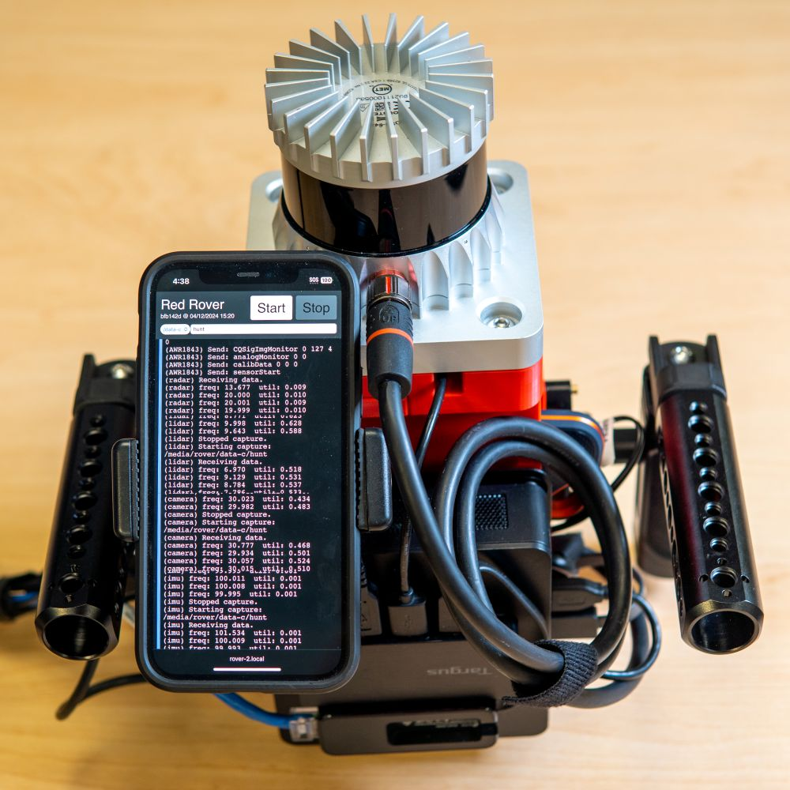

# Roverc: data collection system

**Already have a `red-rover` system?**

:material-arrow-right: See the [usage instructions](usage.md), and read the [data collection tips](tips.md).

**Considering building a `red-rover` system?**

:material-arrow-right: See the [bill of materials](assembly.md).

**Trying to set up a `red-rover` system?**

:material-arrow-right: Follow the [assembly guide](assembly.md) and the [setup guide](setup.md).

## Mechanical Design

**Core Platform**: `red-rover` is built around a laterally aligned lidar, radar, and camera on a handheld platform.

- [TI AWR1843Boost](https://www.ti.com/tool/AWR1843BOOST) + [DCA1000EVM](https://www.ti.com/tool/DCA1000EVM): radar and capture card commonly used for academic radar research; see the [xwr documentation](https://wiselabcmu.github.io/xwr/setup/#awr1843boost).

- [Ouster OS0-32/64/128](https://ouster.com/products/hardware/os0-lidar-sensor) wide field of view (360x90 degree) lidar: provides a good field of view, even in tight and cluttered indoor spaces.

    !!! failure

        The range of the OS0 does suffer considerably in outdoor scenarios; in practice, it only achieves ~20-25m maximum effective range. As such, we limit the maximum range of our radar to 22m. Iterations on `red-rover` should consider upgrading to an OS1 or OS2.

    !!! info

        We also include an additional [XSens MTi-3](https://shop.movella.com/us/product-lines/sensor-modules/products/mti-3-ahrs-development-kit) (hidden beneath the Lidar), which we use for SLAM; we find that this provides better accuracy than the Lidar's onboard IMU due to noise caused by the Lidar rotation, especially when it is running in a faster 20Hz mode.

- [Black Magic Micro Studio Camera](https://www.bhphotovideo.com/c/product/1787638-REG/blackmagic_design_micro_studio_camera_4k.html) + [Olympus Fisheye Body Cap Lens](https://www.bhphotovideo.com/c/product/1026132-REG/olympus_v325040bw000_bcl_0980_fisheye_body_cap.html): the BMMSC can be purchased for around the same cost as a similar computer vision camera, while having a substantially larger sensor and better image quality. The lens does not have the greatest image quality, but f/8 is reasonable for our "zone-focus" use case, and still looks better than a typical computer vision lens.

**Design Features**:

- The `red-rover` platform includes two side handles, each of which has an upper and lower part. This is designed to facilitate holding the rig at a variety of poses, e.g., above the head, at waist level, or below the waist.
- Both handles are easily adjustable and detachable to facilitate easy transport.
- The power supply is located on a backpack-carried power pack to reduce the weight of the handheld portion. However, we opted not to place the data collection computer in the backpack, since this avoids needing to run many data cables to the backpack in addition to the many power cables currently carried by the umbilical.

## Software Design

!!! question "Why not ROS?"

    ROS does have substantial infrastructure as a whole; however:

    - There are no existing ROS nodes for handling radar data.
    - ROS has issues with tracking accurate timestamps.
    - Off-the-shelf ROS nodes, e.g., for collecting lidar data, tend to be very inefficient. For example, our custom lidar recording implementation results in >10x disk savings over recording ros bags of lidar point clouds.
    - ROS tends to have very specific software requirements, that make it difficult to deploy in already-existing systems.

    Finally, the `red-rover` data collection system is really not that complicated, and not overly burdensome to build from scratch. Thus, while we did use ROS in our previous system, [rover](https://github.com/wiseLabCMU/rover), we opted not to use ROS for `red-rover`.

The `roverc` recording software is based on a client-server architecture:

- Each sensor is independently and asynchronously recorded by a separate process running a python data collection program.

    !!! info

        This is accomplished by our [standalone python implementation](https://wiselabcmu.github.io/xwr/) of the TI radar and capture card interfaces, which replaces the windows-only mmWave studio software which is typically used for radar data collection.

- These processes communicate via unix domain sockets to a control server by sending output logs to the server, and receiving commands.
- The control server also exposes a web server (via a flask app) which hosts a GUI which can be used to start/stop data collection, set metadata, and view output logs.
