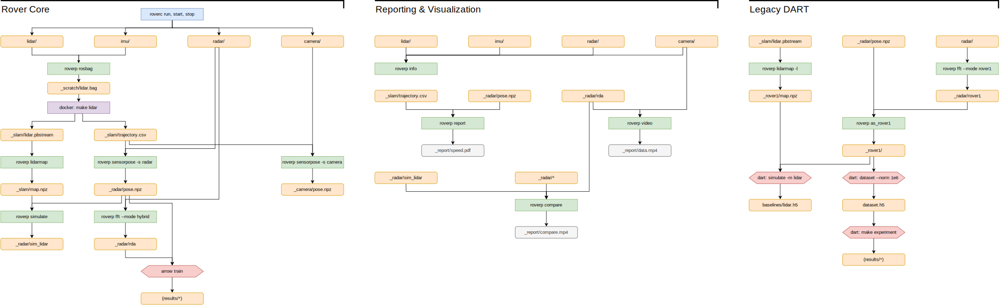

# Usage



## Common Recipes

Get dataset metadata:
```sh
roverp info -p path/to/dataset
```

Upload data to storage server or external drive:
```sh
roverp export -p {path/to/dataset} -o {path/to/destination}
```

Prepare radarhd data:
```sh
export SRC=path/to/dataset
export DST=path/to/destination

roverp export -p $SRC -o $DST --metadata
roverp align -p $DST --mode left
roverp decompress -p $SRC -o $DST
cp $SRC/radar/iq $DST/radar/iq
```

Prepare DART data:
```sh
export DATASET=dataset
roverp rosbag -p data/$DATASET
make lidar
roverp sensorpose -p data/$DATASET -s radar
roverp fft -p data/$DATASET --mode hybrid
```

Generate reports (requires DART data):
```sh
export DATASET=path/to/dataset
roverp report -p $DATASET
roverp video -p $DATASET
```

Generate simulations (requires DART data):
```sh
export DATASET=path/to/dataset
roverp nearest -p $DATASET
roverp lidarmap -p $DATASET
roverp simulate -p $DATASET
```

## Commands

Run `roverp <command> -h` for more information, or see [the full documentation](scripts.rst).

| Command | Description | Inputs | Outputs |
| ------- | ----------- | ------ | ------- |
| `align` | Get sensor timestamp alignments as indices. | any set of sensors  | `_fusion/indices.npz` unless overridden.  |
| `as_rover1` | Convert to legacy DART format. | `radar/`, `_radar/pose.npz`, `_radar/rover1`  | `_rover1/*`  |
| `cfar` | Run CFAR and AOA estimation. | `radar/*`  | `_cfar/*`  |
| `compare` | Create simulation (novel view synthesis) comparison video. | any set of radar-like data in `_radar`, or elsewhere so long as they match the format of `_radar/rda`.  | `_report/compare.mp4` unless overridden.  |
| `decompress` | Decompress lidar data. | `lidar/*`  | `_lidar/*`, unless overridden.  |
| `export` | Export dataset to another location. | an entire dataset.  | the dataset is copied into the `dst` directory (e.g. on an external drive or file server), except for easily recreated processed output files.  |
| `fft` | Generate range-doppler-azimuth images. | `radar/*`, `_radar/pose.npz` (optional)  | `_radar/{mode}` depending on the selected mode.  |
| `info` | Print dataset metadata. | `/*`  | Printed to `stdout`.  |
| `lidarmap` | Create ground truth occupancy grid. | `_slam/trajectory.csv`, `_slam/lidar.bag_points.ply`  | `_rover1/map.npz` or `_slam/map.npz`, depending on `--legacy`.  |
| `nearest` | Run nearest-neighbor simulation. | `_radar/pose.npz`, `_radar/rda`  | `_radar/sim_nearest`  |
| `report` | Get speed report. | `_radar/pose.npz`, `_slam/trajectory.csv`  | `_report/speed.pdf`  |
| `rosbag` | Convert Rover dataset to ROS 1 bag for Cartographer. | `lidar/*`  | `_scratch/lidar.bag`  |
| `sensorpose` | Calculate interpolated poses for a specific sensor. | `_slam/trajectory.csv`  | `{sensor}/pose.npz` depending on the specified `--sensor`.  |
| `simulate` | Simulate radar range-doppler data. | `_radar/pose.npz`, `_slam/map.npz`  | `_radar/sim_lidar`  |
| `slice` | Render map slices. | any map-like data, e.g. `_slam/map.npz`.  | `_report/slices.mp4` unless overridden.  |
| `video` | Create sensor data video. | `camera/*`, `lidar/*`, `_radar/rda`  | `_report/data.mp4`  |

Generate this table with `scripts/_summary_table.py`.
